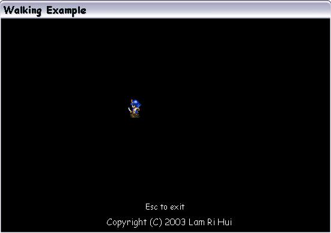



## Walk Example

### Description

Use KeyDown function to move an object. This code shows how to move an object in the form. I use a cartoon samurai as an object. Beginners in programming games may want to learn this. The graphic comes from www.vbgames.co.uk. Comments are welcomed. Please vote.
 
### More Info
 

             |
---                |---
**Submitted On**   |2003-09-06 06:38:02
**By**             |[Lam Ri Hui](https://github.com/Planet-Source-Code/PSCIndex/blob/master/ByAuthor/lam-ri-hui.md)
**Level**          |Beginner
**User Rating**    |4.7 (33 globes from 7 users)
**Compatibility**  |VB 3\.0, VB 4\.0 \(16\-bit\), VB 4\.0 \(32\-bit\), VB 5\.0, VB 6\.0
**Category**       |[Coding Standards](https://github.com/Planet-Source-Code/PSCIndex/blob/master/ByCategory/coding-standards__1-43.md)
**World**          |[Visual Basic](https://github.com/Planet-Source-Code/PSCIndex/blob/master/ByWorld/visual-basic.md)
**Archive File**   |[Walk\_Examp164196962003\.zip](https://github.com/Planet-Source-Code/lam-ri-hui-walk-example__1-48303/archive/master.zip)

